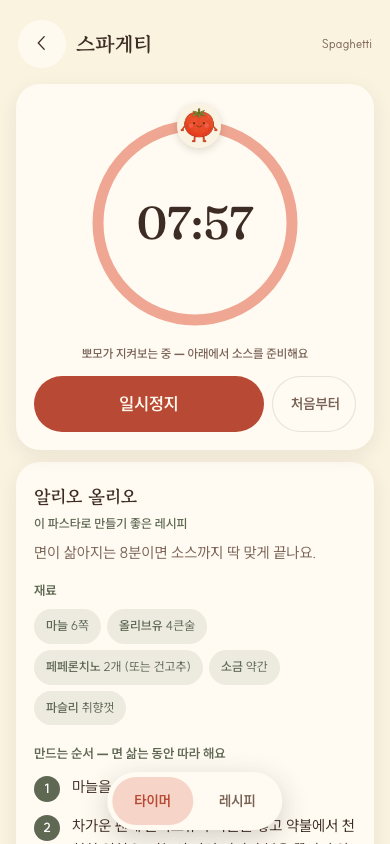
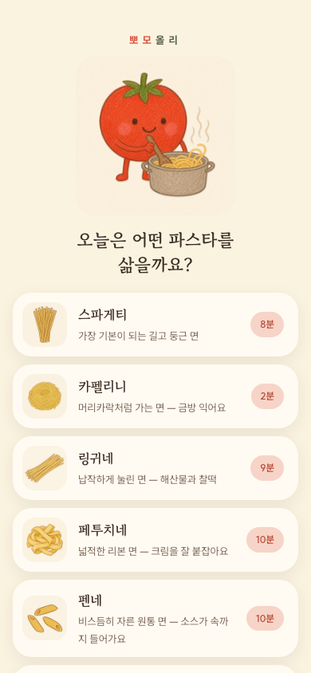
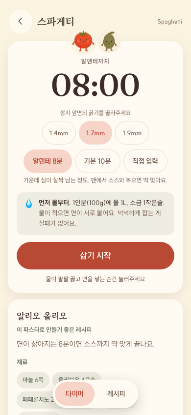
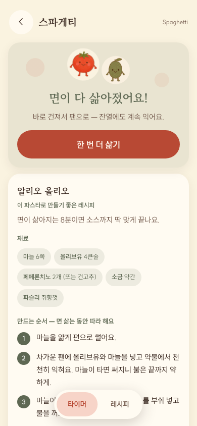

# 파스타 타이머 (뽀모올리)

**면 종류를 고르면 권장 삶기 시간으로 타이머가 시작되고, 같은 화면에서 그 파스타의 소스 레시피를 볼 수 있는 앱.**

주방이라는 사용 맥락에서 문제를 정의하고, MVP 범위를 정해 기획·디자인·개발을 단독 수행한 Product PM 케이스 스터디입니다.

| | |
|---|---|
| **기간** | 2026년 7월 (착수 ~ MVP 완성) |
| **역할** | 기획 · 디자인 · 개발 · 콘텐츠 (1인) |
| **현재 상태** | **MVP 구현 완료. 공개 배포 준비 중** — 배포 링크는 준비되는 대로 이 자리에 추가합니다 |
| **검증** | 자동 테스트 통과 · 헤드리스 브라우저 E2E 검증 완료 / **실사용자 검증은 아직 없음** (아래 [측정 계획](#아직-없는-것과-측정-계획)) |



---

## 문제

파스타는 면 종류마다 삶는 시간이 다릅니다. 스파게티 8분, 카펠리니 2분, 리가토니 11분.
같은 스파게티도 굵기(1.4~1.9mm)에 따라 최대 5분이 갈립니다.

제 사용 경험과 주변 관찰에서 반복적으로 본 흐름은 이렇습니다.

1. 봉지 뒷면의 작은 글씨를 찾아 읽는다 (손에 물이 묻은 채로)
2. 스마트폰 기본 타이머에 숫자를 다시 입력한다
3. 면이 삶아지는 8분 동안 무엇을 할지 몰라 기다린다

세 번째 문제에 주목했습니다. **면이 삶아지는 시간은 소스를 만드는 시간**인데,
기존 타이머는 시간만 세고 끝납니다.

### 기존 대안과 빈틈

| | 시간 입력 | 면별 권장 시간 | 조리 중 레시피 | 설치 부담 |
|---|---|---|---|---|
| 스마트폰 기본 타이머 | 직접 입력 | ✕ | ✕ | 없음 |
| 검색 / 영상 | — | 매번 검색 | 화면 전환·광고 | 없음 |
| 종합 레시피 앱 | — | △ | ○ | 앱 설치·로그인 |
| **이 앱** | 자동 | ○ | ○ (한 화면) | 홈 화면 추가 |

**빈틈**: 면 종류에 묶인 시간과, 그 시간 동안 필요한 최소 레시피가 한 화면에 없다는 것.

## 핵심 설계 결정

| 결정 | 근거 |
|---|---|
| **타이머와 레시피를 한 화면에** | 완료 후 레시피를 제안하면 이미 늦습니다. 상단 고정 타이머 + 하단 레시피 스크롤은 면 삶는 동안 소스를 준비하는 실제 조리 순서와 일치합니다. |
| **시작 전에 물·소금 기준 먼저** | 요리 입문 자료와 제 사용 경험에서 반복된 실패는 시간 착오보다 물 부족으로 면이 붙는 것, 간 맞추기 실패였습니다. 타이머보다 앞에 배치했습니다. |
| **네이티브 앱 대신 PWA** | 앱스토어 심사 없이 웹으로 먼저 배포해 검증 주기를 줄입니다. 홈 화면에 추가하면 앱처럼 동작하고, 검증 후 스토어를 검토합니다. |
| **서버·DB 없는 정적 구조** | 파스타 시간표와 레시피는 정적 데이터. 별도 서버 운영비가 들지 않고, 결과적으로 토스 미니앱의 SSR 불가 요건과도 맞았습니다. |
| **MVP에서 수익화 제외** | 주방에서 쓰는 도구에 광고가 끼면 도구로서 나빠집니다. 핵심 사용 흐름 검증에 집중하고, 재사용이 확인된 뒤 수익 모델을 검토합니다. |
| **타이머 숫자를 세리프체로** | 타이머 앱은 관행적으로 기계적인 모노스페이스를 씁니다. 의도적으로 반대로 가서 스크린샷만으로 식별되게 했습니다. |

### MVP 범위를 자른 기준

사용 빈도와 면 형태의 다양성을 기준으로 대표 10종을 넣었습니다.
즐겨찾기·최근 사용·다중 타이머는 핵심 가설 검증에 필요하지 않아 후속 범위로 미뤘습니다.

## 사용 맥락이 만든 제약

대상 사용자는 **주방 조리대 앞에 서 있는 사람**입니다. 여기서 세 가지 UI 원칙을 세웠습니다.

- **터치 영역 최소 48px** — 젖은 손으로는 작은 버튼을 정확히 누르기 어렵습니다
- **본문 15px 하한** — 조리대에서 팔 길이만큼 떨어져 화면을 봅니다
- **완료 1분 전 예비 신호** — 레시피 대부분이 면수를 쓰는데, 알람이 울린 뒤에는 이미 손이 바쁩니다

## 화면 흐름

| ① 면 선택 | ② 시작 전 확인 | ③ 삶는 중 | ④ 완료 |
|---|---|---|---|
|  |  |  |  |
| 면 종류가 곧 시간 선택 | 물·소금 기준을 타이머보다 먼저 | 타이머 고정 + 레시피 스크롤 | 다음 행동을 안내 |

## 검증에서 발견하고 개선한 문제

- **주요 동작 버튼의 명도 대비 미달** — 시작 버튼이 3.55:1로 WCAG AA 기준(4.5:1)에 못 미쳤습니다.
  기존 색감을 유지하면서 팔레트 안에서 4.86:1로 조정했습니다.
- **타이머 상태가 스크린리더에 전달되지 않음** — 진행 링이 장식 요소로 처리돼 시각장애 사용자에게는
  아무 일도 일어나지 않는 앱이었습니다. 라이브 리전을 추가해 남은 시간과 완료를 낭독하게 했습니다.
- **플랫폼 요건 대응** — 앱인토스 미니앱은 SSR을 허용하지 않습니다. 초기에 서버·DB를 빼 둔 결정
  덕분에 정적 빌드(`output: "export"`) 전환만으로 요건을 맞췄고, 자체 헤더가 토스 내비게이션 바와
  중복되는 문제는 빌드 분기로 분리했습니다. **심사 결과는 아직 확인 전입니다.**

## 아직 없는 것과 측정 계획

정직하게 적습니다. 현재는 MVP 구현 단계로 **실사용자 데이터가 없습니다.**

- 면 시간표와 레시피는 시중 건면 표기와 일반 조리 가이드를 기준으로 한 **기본값**입니다.
  브랜드·굵기에 따라 다르며, 그래서 "직접 입력"과 굵기 선택을 함께 제공합니다.
- 배포 후 확인할 것: 면 선택부터 타이머 시작까지의 과업 성공률, 7일 내 재사용률, 레시피 열람률
- 완료 후 행동(플레이팅·정리)은 아직 다루지 않습니다

## 구현 메모

백그라운드에 다녀와도 시간이 어긋나지 않도록 경과 시간을 **timestamp로 계산**했고,
조리 중 화면이 꺼지지 않게 Wake Lock을, 완료를 놓치지 않도록 소리·진동·알림을 함께 씁니다.
스택은 Next.js 15 정적 export + PWA이며, 상태 관리 라이브러리와 UI 키트는 쓰지 않았습니다.

<details>
<summary>로컬 실행</summary>

```bash
bun install
bun run dev          # 개발 서버
bun test             # 타이머 계산 로직 테스트
bun run build        # 정적 빌드 → out/
NEXT_PUBLIC_TARGET=toss bun run build   # 앱인토스 미니앱 빌드
```
</details>

## 세부 근거 문서

- [PRD](docs/PRD.md) — 문제·범위·성공 기준
- [DESIGN.md](DESIGN.md) — 사용 맥락에서 도출한 디자인 시스템과 화면 규칙
- [PROJECT.md](docs/PROJECT.md) — 의사결정 로그와 트레이드오프

참고: [네이밍 근거](docs/naming-candidates.md) · [토스 미니앱 준비](docs/apps-in-toss.md) · [개선 아이디어 교차검증](docs/ideas-3models.md)

---

비주얼 톤은 토마토·올리브 캐릭터(뽀모·올리)의 크레파스 질감으로 통일했고, 앱 이름도 여기서 나왔습니다.

MIT License · 폰트: Gowun Batang · Fraunces · SUIT (SIL Open Font License 1.1)
